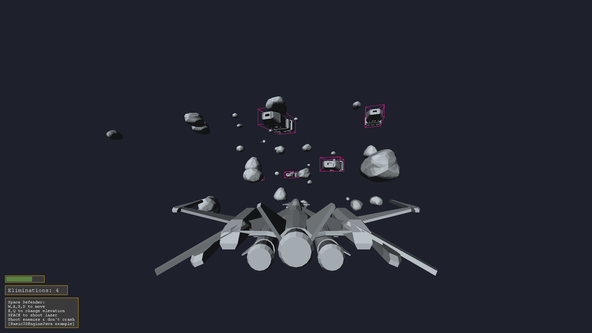
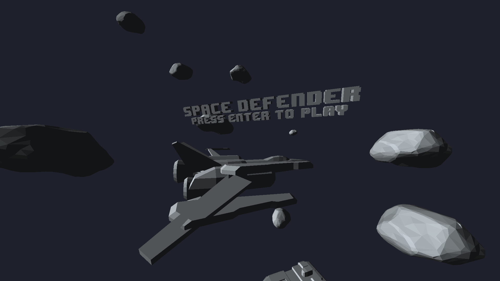

# Basic3DEngineJava
A Basic 3D Software Renderer and Physics Engine written fully from scratch.

## Features
- From scratch implementation of Vec3 & Mat4 classes
- Software rendering pipeline with lighting, back-face culling, depth sorting, and clipping
- Collision detection and response algorithm using AABBs
- Input handler implementation
- Game engine inspired code architecture

## Motivation
This project was born out of a desire to explore and understand the mathematical foundations and rendering techniques that are typically abstracted away by modern graphics APIs.
I'm also interested in game engine architecture, and this project was my, very surface-level, introduction into the structure of game engines.
Since the engine was made up of many interconnected parts, it also served as an experience in larger scale Java projects.
The engine and demo project were completed around May 2023, and I don't plan on updating it any further.

## Demo Project
The engine comes with a small example game to display the features and capabilities of the engine.
The source code for it can be found in the [space-defender-game branch](../space-defender-game).
- PlayerController with tilting animation while flying
- Ability to shoot lasers which can destroy enemy ships
- Collision with asteroids present in the scene
- Magnifying glass powerup to highlight enemies, uses the debug AABB renderer
- Infinitely spawning enemies, asteroids, and powerups

### Menu Screen

### Gameplay

## Performance
As of the [latest commit](../../commit/space-defender-game), on an AMD R9 7950X, the demo project runs at around 30 frames per second with ~21K triangles when compiled with javac through Intellij IDEA Community Edition.
